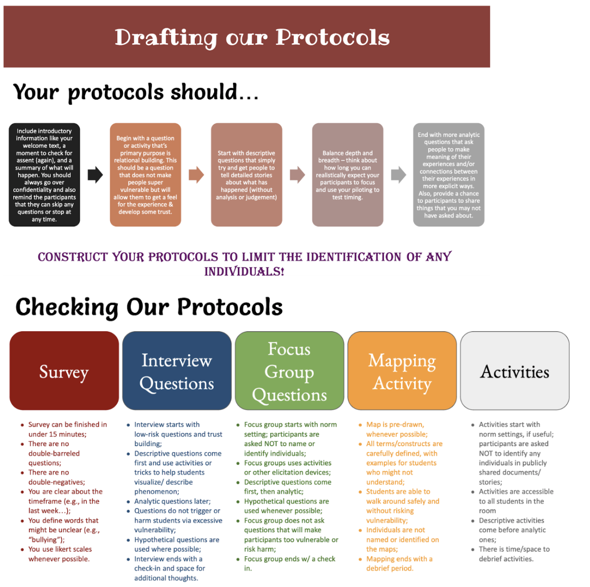

---
title: Lesson 16 - Research Protocols 
layout: home
nav-order: 17
---

# Research Protocols

### Objectives
- Students will learn how to create protocols based on the research method they choose.
- Students will work with their community organizer to complete their research protocols

### Resources
- <a href = "https://drive.google.com/file/d/1VegaEbjnXKdVrhFya2WfFKTlY8QKWyMw/view?usp=drive_link">Research Protocols Discussion Video</a>

### Activity Steps
1. Have the community organizers introduce their work to the entire class
2. Play the video titled, “Research Protocols”. Here is the <a href = "https://docs.google.com/document/d/1WvAx6hz3B1EOYvx-bLw0KEQPb6lvXzRhwmiBWxSei5Y/edit?tab=t.0">script</a>
3. Review the data analytic plan, and <a href = "https://drive.google.com/file/d/1JrVUIbeVPrJ-S_l1Xv-VQTGWalDkyJyM/view?usp=drive_link">study design template</a> with students and community organizers
4. Students should start working on the final project <a href = "https://docs.google.com/document/d/10CVWUbdw-6bjNH-zqeofEikvwJdNdXJqRcjD1z5XUZ8/edit?tab=t.0">checklist</a> with community organizations on the study design template, the <a href = "https://docs.google.com/document/d/13Vj5VbPgjhQgJfOGtPInhDG7k5QXHsVzMGZmx0f7-Cg/edit?tab=t.0">protocol checklist</a>, and  the <a href = "https://drive.google.com/file/d/11VB9OqeXkY5G5kNS-9WMZ3PorDfCbSMm/view?usp=drive_link">data analytic plan</a>
5. Prompt the students to select a research method based on their research question. Students can connect their research questions to their methods by focusing on what they are trying to learn from their data, and how they will be able to acquire that information
6. Once you have selected your methods, you can start drafting your protocols. 
7. After you complete the study design template, protocol checklist, and the analytic plan as a group, assign roles for the remainder of the project using this <a href = "https://drive.google.com/file/d/11aXBZFTD7gi6Srn0J-1t_P-HSzSrYUOE/view?usp=drive_link">graphic organizer</a>. Since each task takes multiple hours, different students will have to work on different tasks at once. Also, since many of the tasks require responses from the community, each task should be started as soon as possible. Also, students should rotate between tasks, so that they are able to try each task. Here is a tip from one of the first data activism undergraduate researchers, Sophia Brady: 
    - “My final project entailed the analysis of our food insecurity dataset, creation of relevant data visualizations, creation and analysis of surveys (our research method of choice), background research on our issue and community organization, and creation of a tote bag with block prints meant to bring awareness to food insecurity. While these steps for completing the final project are split up into separate lessons, in practice, they end up happening around the same time. It is okay if some such steps thus take longer than expected, and others do not take so long…In a normal session, I would split up the group of students into teams to work on data analysis & visualization, survey creation and analysis, background research, and artwork. I usually had two students working on each respective task at a time. About halfway through the session, I would rotate which task they are working on so that they get to do something different.”-Sophia Brady
  

