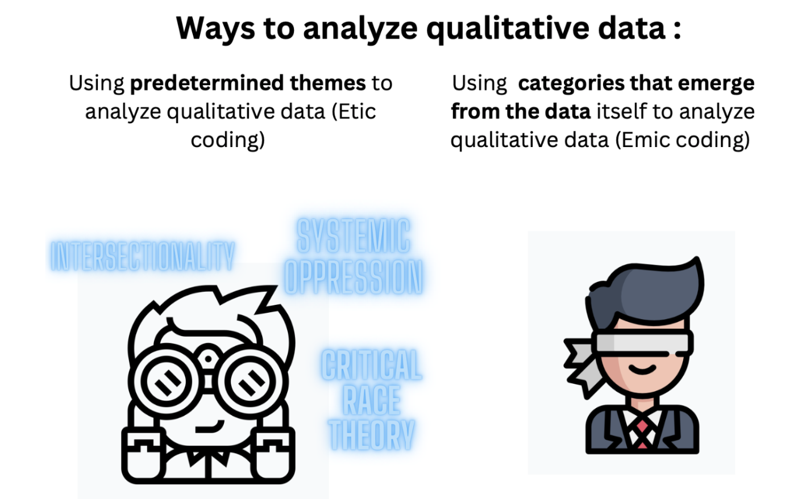

# Analyzing Qualitative Data

### Objectives
- Etic coding involves analyzing data from an outsider's perspective, seeking to identify patterns and themes that are universal or objective. This approach aims to break down the data into manageable parts and uncover underlying structures that may not be apparent at first glance. The goal is to develop a deeper understanding of the data and identify key concepts that can be used to make sense of it.
- Axial coding, on the other hand, involves analyzing data from an insider's perspective, seeking to understand the context and meaning behind it. This approach aims to bring the data back up to its original context and explore its relationships with other data points. The goal is to develop a comprehensive understanding of the data and tell a story that community members can relate to and help make sense of.
- By combining etic and axial coding, researchers can gain a more nuanced understanding of the data and uncover insights that might be missed by focusing on just one approach. This can lead to more informed decision-making and a deeper understanding of the community being studied.

### Resources
- <a href = "https://drive.google.com/file/d/1t-OyM4Ci--kUZsaND0RhY6a2ukWC0ALy/view?usp=drive_link">Analyzing Qualitative Data Discussion Video</a>

### Activity Steps
- Review the <a href = "https://drive.google.com/file/d/1gjiNgdejRLMR9RtZQOe3Z2oRjQElogJo/view?usp=drive_link">slides</a> that describe the two different ways  to analyze qualitative data
- Etic coding is a method of qualitative data analysis that involves analyzing data from an outsider's perspective. It involves identifying themes and patterns in the data that are consistent across different cultures or groups. Here are some steps for doing etic coding for qualitative analysis at the high school level:
    1. Select a research question: Choose a topic or question that you want to explore. It could be a social issue or a phenomenon that you have observed in your school or community.
    2. Collect data: Collect data through methods such as interviews, surveys, observations, or existing documents such as newspapers, reports, or social media posts.
    3. Transcribe data: If you have collected data through interviews or recordings, transcribe them into text format.
    4. Read and re-read the data: Read through the data multiple times to get a sense of the overall content and context.
    5. Identify themes: Look for patterns or themes that emerge from the data. You can use codes or labels to identify these themes.
    6. Group themes: Group the themes into categories or sub-themes. This helps to organize the data and make it easier to analyze.
    7. Analyze the data: Analyze the data by examining the themes and categories, and looking for connections or relationships between them.
    8. Draw conclusions: Based on the analysis, draw conclusions or make inferences about the research question or topic.
    9. Communicate findings: Communicate the findings through a report, presentation, or other means.

Remember to be systematic, objective, and detailed in your analysis. It's also important to maintain confidentiality and respect the privacy of participants when working with qualitative data.

- Emic coding is a qualitative analysis technique that involves identifying and categorizing themes and patterns in data based on the perspectives and experiences of the participants. Here are some steps to help you get started with emic coding for a high school-level qualitative analysis:
    1. Define your research question: First, define your research question or topic of interest. This will guide your data collection and analysis.
    2. Collect data: Collect data through interviews, surveys, or observations. Make sure you obtain consent from participants and maintain confidentiality.
    3. Transcribe the data: Transcribe the data from the interviews or recordings. This involves typing out the spoken words of the participants.
    4. Read and re-read the data: Read and re-read the transcribed data to become familiar with the content.
    5. Identify initial codes: Begin identifying initial codes by highlighting or underlining key words, phrases, or concepts that relate to your research question. For example, if you are studying student attitudes towards online learning, you might highlight words such as "technology", "remote", "difficult", "convenient", and "challenging".
    6. Create code categories: After identifying initial codes, create categories that group similar codes together. For example, you might create a category called "challenges" and include codes such as "difficult" and "challenging" under this category.
    7. Revise and refine codes: Continuously revise and refine your codes and categories as you analyze more data. Look for patterns and connections between codes to identify overarching themes.
    8. Analyze and interpret the data: Use your codes and categories to analyze and interpret the data. Look for trends, similarities, and differences across participants and within the data.
    9. Write up your findings: Write up your findings in a report or paper, using quotes from the data to support your conclusions.

Overall, emic coding is a powerful qualitative analysis technique that allows you to gain a deep understanding of the experiences and perspectives of your participants. With practice and patience, you can use this technique to uncover important insights and findings in your research.

- Now it’s time to practice: 
    - Analyze a <a href = "https://docs.google.com/document/u/0/d/1TvMN89WvLyQBZaHgKCN9lFWExUaAVIAK/edit?fromCopy=true&ct=2">dataset</a> using etic and emic coding
- How to analyze this dataset using etic coding
  
- How to analyze this dataset using etic coding

[PHOTO]
