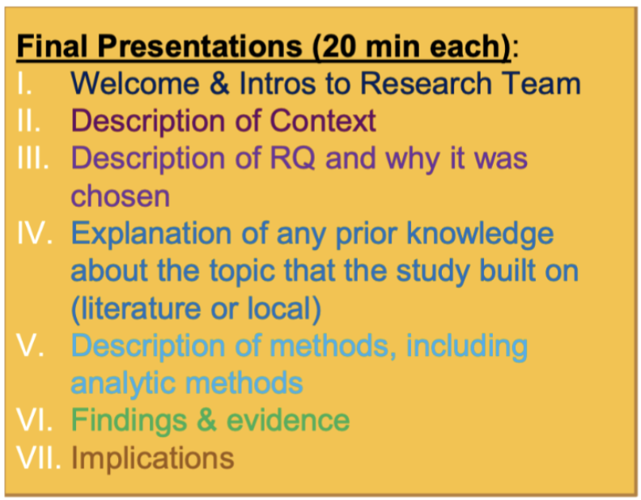

# ArcGIS StoryMaps

### Objectives
- Students will learn how to create interactive data visualizations with ArcGIS StoryMaps
- Students will learn how to create StoryMaps, which incorporate images and the student’s story into their final websites    

### Resources
- <a href = "https://drive.google.com/file/d/11oWfROsfLskKPBG1Q-36WKrYdkkXJVJT/view?usp=drive_link">ArcGIS Discussion Video</a>
- Script
- <a href = "http://dataactivism.maps.arcgis.com">ArcGIS Website for the Data Activism Group</a>

### Activity Steps
1. Play a video titled, “ARCGIS Tutorial” . Here is the script for the video. 
2. Students have the option to craft a narrative using StoryMaps. If students and community organizers determine that StoryMaps are the optimal method to showcase their research, utilizing a StoryMap is recommended. The sections typically included in a StoryMap are as follows:

<a href="https://creativecommons.org">Data Activism Program</a> © 2025 by <a href="https://creativecommons.org">Raechel Walker</a> is licensed under <a href="https://creativecommons.org/licenses/by-nc-sa/4.0/">CC BY-NC-SA 4.0</a>