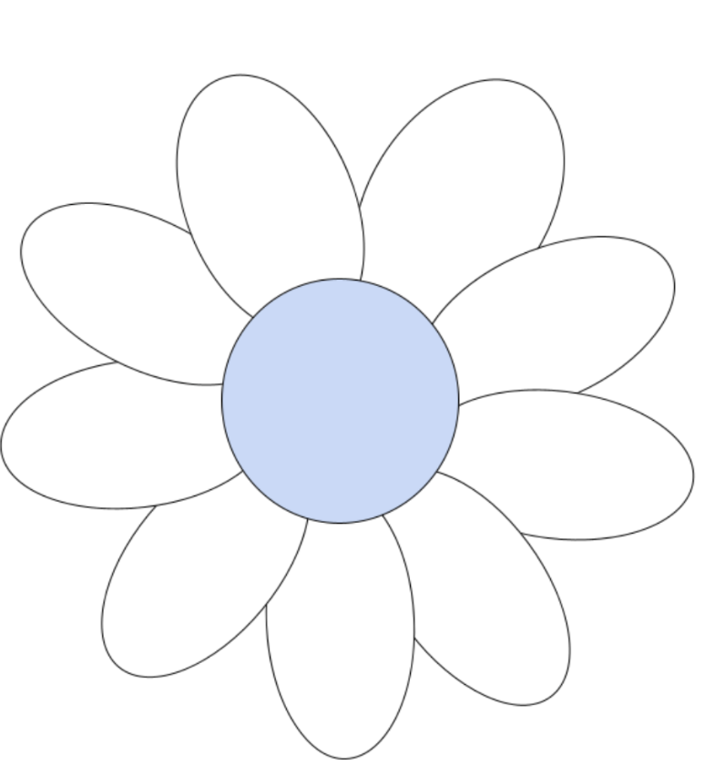

# Daisy Model

### Objectives
- Students will learn how to critically analyze data about themselves

### Resources
- <a href = "https://docs.google.com/document/d/1njXBX-AXcD-xRjVfyD97XdM41lieaSHeBkA1wAlpAcc/edit?tab=t.0">Daisy Model Activity</a>
- <a href = "https://drive.google.com/file/d/155tophP8Y8HuHxvDAWffRD_kYXgmuB2e/view?usp=drive_link">Daisy Model Discussion Video</a>

### Preparation Notes
- Create your own Daisy Model to share with the class, time permitting

### Activity Steps

1. Play the  instructional video titled “Daisy Model”. The video clip is approximately 56 seconds. Here is the <a href = "https://docs.google.com/document/d/1J8kceovuOPjEx9AWn9UG6KtP1c4LuBrCs3VgP7C2Yk0/edit?tab=t.0">script</a> used in the video.
2. Have students brainstorm examples of datasets with the full classroom. Take two minutes to collaborate with your group and generate some ideas.
3. Instruct students to answer the following questions with the full classroom."What are data points about ourselves that we want people to know?,What might someone want to know?, and What are different aspects of our identity that might make it more difficult for us to navigate society?” (5 minutes)
4. Play the  instructional video titled “Daisy Model”. The video clip is from 56 seconds - 4 minutes and 56 seconds. Here is the <a href = "https://docs.google.com/document/d/1Kh2L3DC8TdqfjbAW5zdSzPv0QfrbQK1KfBOHj6KOobM/edit?tab=t.0">script</a> used in the video.

{: .note }
The Daisy Model is a tool originally developed as part of the Coordinated Management of Meaning (CMM) communication theory. Its original usage and intention was to express the many different personal contexts that someone brings into a conversation; in this activity, it will instead be used to express the many different personal contexts that students see as part of their identities.

5. Introduce part 1 of the activity – asking students to independently draw their own daisies.
    - Try to create a daisy of your own ahead of time to show them as an example, if possible. If you don’t have one, then take some time to model drawing one and adding aspects of your identity to it yourself in front of the students.
    - There is a model daisy in the student workbook that students can use for building their daisies digitally if you’d like - they’ll need to add text boxes on the slide with the daisy to fill it in. If they’d prefer to hand draw their daisies, that also works.
6. Explain to students that they will be using the Daisy Model as a framework for answering the question about data they’d like to share. The goal of the framework is to provide segmented data about their identities, which will be used to build a dataset with some standardization, and some complexity.

{: .note }
>The daisy itself is simply a vessel for expressing multiple ways of seeing yourself. If a student wishes to draw a different container for their activity – such as a house, or a different type of flower, etc. – that is fine as well. 
>
>Also, it is important to remind students that **they do not need to share any more information than they feel comfortable sharing** - just because another student, or you as the teacher, share something about yourself does not mean that students also have to share that same type of information about themselves if they do not feel comfortable doing so.

7. After modeling how to make a daisy, give students about 10 minutes on their own to draw their daisies You must include these 3  aspects of your identity on your Daisy Model:
    - Your name
    - A form of oppression you experience or may experience based on a certain aspect of your identity
    - “Calling” column that explains whether you have a faith or secular based calling. You can put "not sure" if you don't know what your calling is yet. 
8. Once students are finished, gather them back together to introduce the next part of the activity – sharing their daisies with each other. Ask each person to share their petals, and why those petals are important. Forming groups in this activity can be an opportunity for students who don’t know each other as well to get to know each other better.
    - Once students split into groups, keep track of time for sharing.
        - Give 2 minutes for one person to share, without interruption. After that, give the other students 1 minute to respond, and express appreciation and interest in what the other student shared. Then switch roles.
    - After everyone shares their daisies,  answer the following questions: “What resonated with you?”, “What did you appreciate?”, and “What did you not know before?

<a href="https://creativecommons.org">Data Activism Program</a> © 2025 by <a href="https://creativecommons.org">Raechel Walker</a> is licensed under <a href="https://creativecommons.org/licenses/by-nc-sa/4.0/">CC BY-NC-SA 4.0</a>