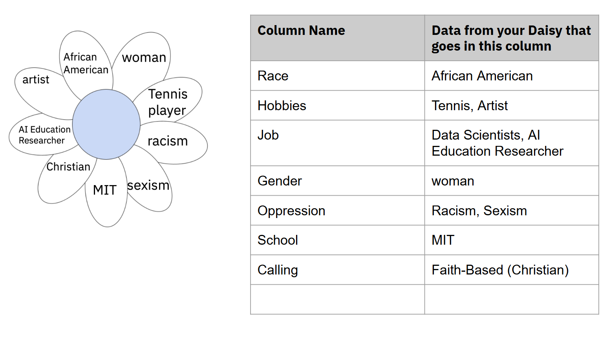

# Data in Google Sheets

### Objectives
- Students will learn how to clean and label data
- Students will learn how to use basic Google Sheets tools 

### Vocabulary
- **Data Cleaning, n.** the process of fixing or removing incorrect, incorrectly formatted, duplicate, or incomplete data within a dataset. 
- **Data Standardization, n.** the process of creating standards and transforming data taken from different sources into a consistent format that adheres to the standards.
- **Consent, n.** permission for something to happen or agreement to do something.

### Resources
- <a href = "https://docs.google.com/presentation/d/1sJea8Ct2k4bjt6oIXRLaC7Yjp5HqwRTzPGuf76P1e58/edit%23slide=id.g1fbbee7cadf_6_263">Student Workbook for Lesson 5</a>
- <a href = "https://docs.google.com/spreadsheets/">Google Sheets</a>
- <a href = "https://docs.google.com/document/d/1d78qobhKVOFPC0eXFzUZnx8O3mNTci-a2nUEdfe4-Jg/edit?tab=t.0">Group Dataset Instructions</a>
- <a href = "https://drive.google.com/file/d/1ld7-o_M3yzmPexLGsjWTmsbxgdE6fAlg/view?usp=drive_link">Data in Google Sheets Discussion Video</a>

### Activity Steps
1. Play the video titled, “Data in Google Sheets” for 36 seconds. Here is the <a href = "https://docs.google.com/document/d/1rGziQMgTiOvVdG5wi7Yf82efsRd2APVeFVkVr1kFvZE/edit?usp=sharing">script</a> for this video
    - As a class, pause the video to discuss your answers to the question: "How can we compile information from our Daisy models into one dataset that represents us as a group?" 
2. Play the video titled, “Data in Google Sheets” from 36 seconds -until the end. Here is the script for this video. The <a href = "https://docs.google.com/document/d/1gDRxR0APbQGFexyOtSA8Z3-pYfi80glK5sz_7y9BLmc/edit?usp=sharing">script</a> contains the exact steps for the activity
3. Here are the topics discussed in the video: Standardizing and Cleaning Data (20 minutes)
    - In order to take the data from Daisies and put them into a format that can be stored in a dataset, we will use two processes: **Data Standardization**, and **Data Cleaning.**
        - **Data Standardization** is “the process of creating standards and transforming data taken from different sources into a consistent format that adheres to the standards.”(Egnyte). The final dataset will have different identities, which may not all have predefined categories to which they belong. You will need to standardize these identities into “types” of data.
        - **Data Cleaning** is “the process of fixing or removing incorrect, corrupted, incorrectly formatted, duplicate, or incomplete data within a dataset.” (Tableau). It will be difficult to create data visualizations if you have a column where some words are capital letters and some words are lowercase. For example, you may notice that not everyone in your class has the same columns. 
5. Submit the <a href = "https://docs.google.com/document/d/1RSFEyC_1X2wv7srKWLAb-GSZ4HXgvBq9sooJ7ClsXNo/edit?usp=sharing">Column Names-Individual Brainstorm Chart</a>: For each piece of information in your daisy, come up with a category in which that data could be put. You can add other data you’d like to as well, even if not in your Daisies.You can use your Daisy or the model made by Raechel to choose one petal and think about categorizing it for data cleaning purposes.
    - One of my petals says that I see myself as an artist. Assuming that others in my group used a similar word - musician, painter, etc. - I could create a data category for this.
        - One way of viewing the category could be “Hobbies”, in which I would put “art”
        - Another way of viewing the category could be “Creative Outlet”, in which I would put “art”
        - It comes down to the shared intentions behind why everyone in your group put down their similar identity
        - You must include these 3 columns: The “Name” column should include your  name. The “Oppression” column should include a form of oppression you experience or might experience based on a certain aspect of your identity. The “Calling” should include whether you have a faith or secular based calling. If you are not sure what your calling is, you can type, “not sure”
        - Once everyone in your group has created their columns, it is important to ensure that all of the column names are in the same format. This includes checking that all column names are spelled correctly and that they are consistent in terms of capitalization and punctuation. Also, none of the column names should  have any spaces in between words. Instead, replace all spaces with an underline “_”.  **The goal is to make sure the data is consistent, accurate and usable for analysis.**
6. Tell students they will practice their standardization and cleaning skills in their small groups of 10 groups.
    - Once you have completed the column names and values for each row, now you will work with your small group to create a dataset that combines all of your datasets.  Create an empty data set on the white board or a virtual white board and submit a picture of the whiteboard. Take turns telling people what column names you have. Everytime, someone says a new column name, add the column name to the dataset. Your dataset should look like the image below after everyone has added their column names to the dataset. Based on what each person says, consolidate column names where there is overlap or add each other’s columns that you don’t have. Each row should represent a different person. If you do not identify with a column that someone has in their dataset, then still add that column and write FALSE in the cell under that column.
    - Now that you've drawn your first dataset, it’s time to Create a new workbook in Google Sheets with a name that describes the data you’re about to add. Then, copy your drawn dataset into Google Sheets
    - Here are a few steps on how to add data to Google Sheets. First, add column names to the first row. Make it clear which row is the “header row” (you can bold the text or change the background color). Next, input the data into Google Sheets.  Ensure that all of you use the same format for the values in each cell. After your group has completed those steps, you are all done. Congratulations! You've just created a dataset.

{: .note }
> Some students may feel inclined to fill in information they think they know about another student (such as a friend), even if that student does not share a given piece of information about themselves explicitly. For instance, student 1 may decide not to share a hobby that they do under a category of “hobbies”, even though student 2 knows that they do dance outside of school. 
>
> It is important to remind students that just because they know something about someone does not mean they can add that data point to their dataset. It is important to get consent from people when putting their information into datasets that will be shared broadly. So, they should only add information they have permission to add to a dataset they build in a group.

<a href="https://creativecommons.org">Data Activism Program</a> © 2025 by <a href="https://creativecommons.org">Raechel Walker</a> is licensed under <a href="https://creativecommons.org/licenses/by-nc-sa/4.0/">CC BY-NC-SA 4.0</a>