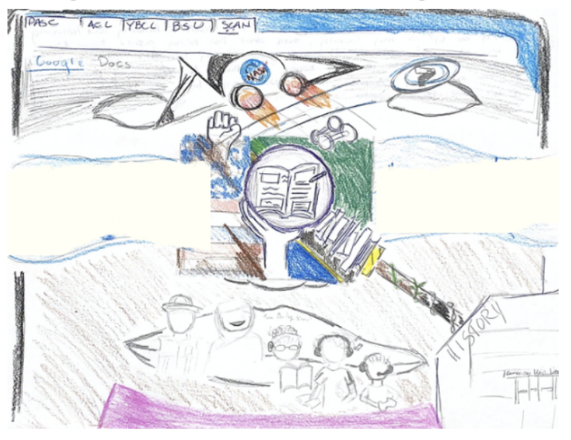

#  Data Drawings

### Objectives
- Students will learn how art can be used to represent data in a way that helps people empathize with minoritized groups.
- Students will learn how data drawings can be more effective than traditional data visualizations  in communicating systemic problems to a non-technical audience.

### Vocabulary
- **Data drawing**, n. an art piece that represents a data visualization 

### Resources
- <a href = "https://justpractice.work">Soft City</a> Article: “Soft City is a large-scale textile series that maps the urban fabric of Black neighborhoods in the Boston area. The tapestries map historic (redlined) and contemporary Black neighborhoods, including Roxbury, Dorchester, and East Cambridge. The information mapped tells the story of the past, present and future of Black residents, and the ecological resilience of the neighborhoods they live in. Hard (impervious) and soft (pervious) land uses are codified using colors with overlays of future tree plantings and flood zones on the tapestry. The softness and materiality of tufting interrogates the traditional top-down approach to space planning and management in the city and offers new tactile ways to explore our understanding of urban space, at all ages.” (The Guardian).
- The third attribute of data activism includes using art to empathize with people who are oppressed. Students will watch the video titled, <a href = "https://www.youtube.com/watch?v=Zg1HvexuNKM">“Pain and terror: America remembers its past”</a>. Here is the description of the video: “More than 4,300 men, women and children were lynched by white mobs between 1877 and 1950. As America’s first memorial and museum dedicated to the legacy of enslaved black people opens in Montgomery, Alabama, Guardian US chief reporter Ed Pilkington meets founder and racial justice lawyer Bryan Stevenson” (The Guardian). 
- <a href = "https://classroom.google.com/c/Njk0MDcwMTM3ODU5/m/Njk1MTYzNjQwNjA5/details">Data Drawings Discussion Video</a>
- <a href = "https://drive.google.com/file/d/1Aws59wkvTKvrxqTjTW9G2sYp9JcO1kOs/view?usp=drive_link"> Data Drawings Slides</a>

### Materials
- Paper
- Pencil
- Color pencil

### Activity Steps
1. Play a video titled, “Data Drawing” from the beginning until the 1 minute and 14 second mark. Here is the <a href = "https://docs.google.com/document/d/1I059-47JF55rZhHU2HQMIQZCQzU3REPDsEPst9cFMcg/edit?tab=t.0">script</a> and slides that correspond with the video. 
2. Show the students the Soft City Article and complete the 3,2,1. Then discuss your answers as a class. 
3. Play a video titled, “Data Drawing” from the 1 minute and 14 seconds - 1 minute and 26 seconds. Here is the <a href = "https://docs.google.com/document/d/12jBqA6fD9xqqq8MPL1hOvKuQjF3mwRTpVcTA2DGdXAk/edit?tab=t.0">script</a> and slides that correspond with the video. 
4. Have students watch the video titled, “Pain and terror: America remembers its past”. Similar to what they have done in previous lessons, have students take notes using the 3,2,1 framework
5. Play a video titled, “Data Drawing” from the 1 minute and 26 seconds. Here is the <a href = "https://docs.google.com/document/d/1TqT7Q24IlyODISezO6p7x7ytxLvCyYErOH5kuMqpoxI/edit?tab=t.0">script</a> and slides that correspond with the video
    - Ask the students to examine the group data they created about their classroom, and to find at least one aspect of their identities that they all have in common.
    - Have everyone in the group create a drawing that represents an aspect of their identity that they have in common with their group. For example, if the group enjoys playing tennis or reading books, the drawings could depict that. If the group of 3-4 students can not find anything in common, students can create a drawing that represents the different aspects of their identity that are included in the data set. Here is one example of a student that created a data drawing that represented their dataset. Their data drawing represented their interests in social justice through the use of a raised fist symbol. Additionally, their data drawing represents their interests in engineering through the inclusion of the NASA logo.
    - Students are encouraged to use paper, color pencils, and markers to create their drawings
    - Instruct students to share their images

<a href="https://creativecommons.org">Data Activism Program</a> © 2025 by <a href="https://creativecommons.org">Raechel Walker</a> is licensed under <a href="https://creativecommons.org/licenses/by-nc-sa/4.0/">CC BY-NC-SA 4.0</a>